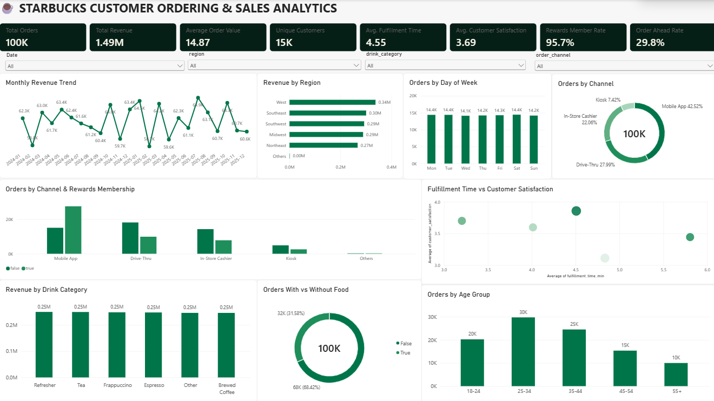

# Starbucks Customer Ordering & Sales Analytics

An interactive Power BI dashboard designed to analyze Starbucks customer ordering patterns, sales performance, customer behavior, and operational metrics.

## Dashboard Preview

## Key KPIs

- **Total Orders:** 100K
- **Total Revenue:** $1.49M
- **Average Order Value:** $14.87
- **Unique Customers:** 15K
- **Average Fulfillment Time:** 4.55 min
- **Average Customer Satisfaction:** 3.69 / 5
- **Rewards Member Rate:** 95.7%
- **Order Ahead Rate:** 29.8%

## Dashboard Insights

The dashboard provides an interactive view of:

- Monthly revenue trends
- Revenue by region
- Orders by order channel
- Orders by day of week
- Orders by customer age group
- Revenue by drink category
- Orders with vs. without food
- Order channel and rewards membership analysis
- Fulfillment time vs. customer satisfaction

## Interactive Features

Users can dynamically filter the dashboard using:

- Date
- Region
- Drink Category
- Order Channel

All visuals are interconnected, allowing users to explore how different customer segments and ordering channels affect sales and operational metrics.

## Tools & Technologies

- Power BI
- DAX
- Power Query
- Data Cleaning & Transformation
- Data Modeling
- Interactive Data Visualization

## Data Preparation

The dataset was cleaned and prepared using Power Query, including:

- Duplicate order removal
- Missing-value handling
- Data type standardization
- Date table creation
- Age-group sorting
- Calculated measures using DAX

## DAX Measures

Key measures include:

- Total Orders
- Total Revenue
- Average Order Value
- Unique Customers
- Average Fulfillment Time
- Average Customer Satisfaction
- Rewards Member Rate
- Order Ahead Rate

## Project Objective

The objective of this project is to transform raw customer ordering data into an interactive business intelligence dashboard that can help identify sales trends, customer behavior patterns, channel performance, and operational insights.

## Author

**Samir More**

- GitHub: [samirmore7](https://github.com/samirmore7)
- Portfolio: [Samir More Portfolio](https://samirmoreportfolio.netlify.app/)
